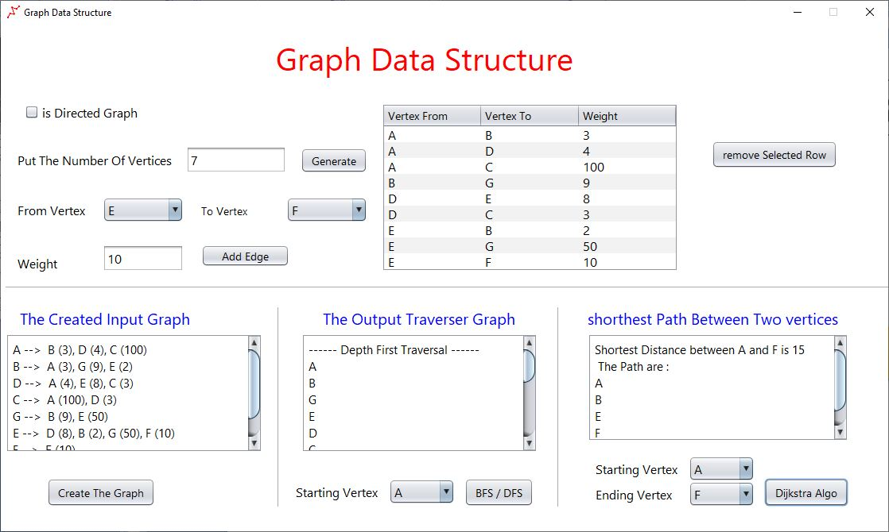

# GUI Java Graph Data Structure With (BFS-DFS) Traversal And Dijkstra Algorithm
### this project focused on Graph Data structure which accepts the input user through the swing library java frame

the followed approach is object oriented programming java language and simple frame to gather the user input data graph.

the input data program are :
- checking the box field (checkbox) if you want to put a directed graph.
- inserting the number of vertices
- inserting the  edges that connect the vertices with the weight.

the output will be :
- printing the inserted graph (each vertex with its neighboors)
- printing the BFS(breath first search) and DFS (depth first search ) traversal starting from a specific vertex.
- printing the shortest path between two vertices using Dijkstra algorithm in addition into path to reach into targeted vertex.

## Frame Screenshot

 

## video explanation

https://www.youtube.com/watch?v=tOJnOnJQSGA

